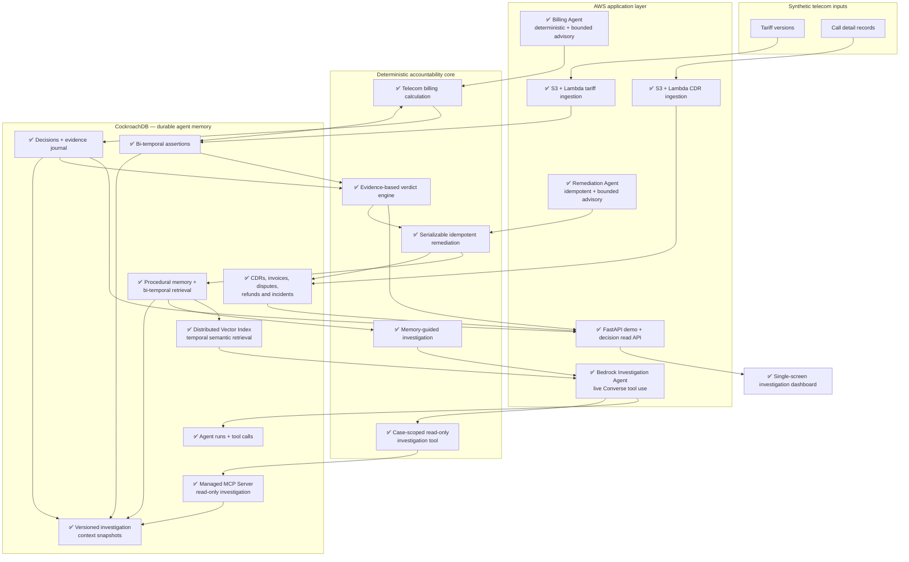

# HindSight

> Judge the decision. Not the hindsight.

**Temporal Decision Accountability for AI Agents**

HindSight reconstructs what was true, what an agent could know, what evidence it used,
and whether its decision was reasonable at that moment. The reference workflow audits a
synthetic telecom billing dispute caused by a late retroactive tariff.

## Current milestone

This repository implements the deterministic P0 foundation, a bounded three-agent
workflow, and deployable AWS boundaries for the web application and ingestion:

- generic bi-temporal assertions;
- append-only fact versions with supersession metadata;
- parameterized CockroachDB truth and knowledge queries;
- a telecom domain adapter that calculates billing without an LLM;
- an idempotent decision journal with explicit availability, retrieval, presentation,
  and usage evidence;
- a deterministic accountability verdict derived from that evidence;
- a serializable, idempotent remediation that corrects the invoice, creates one refund,
  closes the dispute, and opens one ingestion incident atomically;
- procedural memory written in the same CockroachDB transaction;
- bi-temporal procedural retrieval that guides a second, similar investigation without
  changing its deterministic verdict or financial calculation;
- CockroachDB Distributed Vector Index retrieval over Bedrock Titan embeddings, with exact
  domain filters, temporal eligibility checks, similarity scores, and structured fallback;
- a client-side Bedrock Converse tool-use loop with one case-scoped read-only tool;
- Billing and Remediation agents that keep all calculations and mutations deterministic,
  use Bedrock only for bounded advisory English, and share one correlation ID with the
  Investigation Agent;
- an optional CockroachDB Cloud Managed MCP transport that serves that tool through one
  fixed, bounded `select_query` instead of exposing SQL generation to the model;
- durable CockroachDB `agent_runs` and `tool_calls` traces, including bounded inputs,
  results, token usage, stop reasons, and sanitized failures;
- a FastAPI health/demo boundary, bounded decision/truth/knowledge/evidence/verdict reads,
  and one responsive dashboard that renders the decision, temporal timelines, evidence,
  remediation, and before/after memory proof;
- a non-root Python 3.12 container and an image-based App Runner template with a health
  check, bounded demo scaling, runtime secrets, and structured request logs;
- private, encrypted, versioned S3 tariff and CDR intakes with image-based Lambdas,
  bounded validation, SHA-256 provenance, idempotent writes, failure queues, and
  single-worker backpressure;
- a reproducible 35-scenario Knowledge-at-Decision-Time regression benchmark;
- a bounded local/live operational preflight that never prints credential values;
- idempotent demo data, focused tests, and a CLI proof with a safe replay.

The demo proves that a EUR 0.15 rate is current truth while the billing agent could only
know and select the EUR 0.25 rate on July 2, 2026. The resulting verdict is
`wrong_not_knowable`. A later dispute on the same route and service retrieves the prior
procedure before its audit, proposes a root cause, and loads four reusable verification
steps. The deterministic audit then confirms the suggestion; memory remains advisory and
is never an input to the verdict or financial calculation.

## Run with uv

Requirements: [uv](https://docs.astral.sh/uv/) and Python 3.12–3.14.

```bash
uv sync
uv run hindsight demo
uv run hindsight serve
uv run pytest
```

The demo command uses a local in-memory repository so contributors can verify the
domain logic without secrets. It exercises the same service layer used by CockroachDB.
The dashboard is then available at `http://127.0.0.1:8000`. It does not mutate on page load:
`GET /demo/workspace` only reads the explicit demo queue and completed audits. An empty
register exposes no audit action. `POST /demo/prepare` loads one synthetic report without
running the workflow; only then can **Run the audit** claim it through the guarded,
single-flight `POST /demo/seed`. The underlying workflow remains idempotent and uses
CockroachDB when `DATABASE_URL` is configured.
If the fixed sample decision already exists in audit history, the interface labels the
operation as a replay instead of presenting it as a new incident. Use the in-memory server
or an isolated database when demonstrating a genuinely fresh `0 -> 1 -> 0` queue transition.
`GET /health` probes the database with `SELECT 1`. The read API exposes
`GET /decisions/{id}` plus `/truth`, `/knowledge`, `/evidence`, and `/verdict`; all reads
are parameterized, bounded, redacted, and returned with `Cache-Control: no-store`.
`GET /memories/search` derives the CockroachDB namespace from a server-side agent policy,
caps results at 20, and returns `503` when durable memory is not configured.

The web replay never invokes billable Bedrock, vector, or MCP operations implicitly. A
deployed service enables them only when the corresponding `HINDSIGHT_DEMO_BEDROCK`,
`HINDSIGHT_DEMO_VECTOR`, and `HINDSIGHT_DEMO_MCP` flags are explicitly `true`. Startup
rejects incomplete combinations instead of silently presenting a partial proof. The CLI
commands below remain the fastest way to verify each integration independently.

To run the proof against CockroachDB, configure separate schema-owner and least-privilege
runtime URLs in the environment:

```bash
uv run --env-file .env hindsight migrate
uv run --env-file .env hindsight demo --cockroach
```

The explicit `--cockroach` flag prevents a local demo from mutating a database merely
because `DATABASE_URL` exists in the shell. Migration and runtime credentials remain
separate. Run `migrate` again after pulling a new migration; every migration is safe to
replay. Serializable conflicts retry with bounded backoff, while an ambiguous commit is
reconciled through stable remediation or journal identifiers on a fresh connection.

The vector proof is also explicit because it invokes Bedrock Titan and can be billable:

```bash
uv run --env-file .env hindsight demo --cockroach --vector
```

It embeds the immutable procedure after the financial remediation commits, stores the
1,024-dimensional vector in `memory_embeddings`, and retrieves it through the cosine
`memory_embeddings_cosine_idx`. Exact index prefixes restrict domain, namespace, kind,
embedding model, route, and service before ANN search. Bi-temporal eligibility and case
exclusion are applied to a bounded candidate set, expanded once when post-filtering leaves too
few results. Matches below the `0.80` similarity safety floor are rejected; the existing
structured lookup remains a deterministic fallback. Replays do not re-embed an unchanged
stored procedure, while retrieval queries still invoke Titan. Embedding failure cannot roll
back a corrected invoice or refund.

The migration never changes cluster-wide settings. An operator can verify DVI with
`SHOW CLUSTER SETTING feature.vector_index.enabled`; only an administrator should enable it
when required. The application and migration users do not need that cluster privilege.

The Bedrock proof is explicit, durable, and potentially billable. Configure `AWS_REGION`
and `BEDROCK_MODEL_ID`, use the normal AWS SDK credential provider chain, then run:

```bash
uv run --env-file .env hindsight demo --cockroach --bedrock
```

For the complete hackathon proof with both the distributed vector memory and the durable
agent investigation, run:

```bash
uv run --env-file .env hindsight demo --cockroach --vector --bedrock
```

To route the same case-scoped evidence tool through the
[CockroachDB Cloud Managed MCP Server](https://www.cockroachlabs.com/docs/cockroachcloud/connect-to-the-cockroachdb-cloud-mcp-server),
set `COCKROACH_MCP_CLUSTER_ID` and `COCKROACH_MCP_API_KEY` for a dedicated service account,
run the new migration, then add `--mcp`:

```bash
uv run --env-file .env hindsight migrate
uv run --env-file .env hindsight demo --cockroach --vector --bedrock --mcp
```

The deterministic application persists immutable, content-addressed context snapshots, so the
same dispute can safely have distinct structured and vector-memory views. Each agent run records
the exact snapshot ID it was assigned. Bedrock still sees only `get_investigation_context`; the
orchestrator maps it to one `select_query` constrained by that snapshot ID and dispute UUID with
`LIMIT 1`. The MCP response is bounded before parsing and the final tool result remains capped at
64 KB. The API key is never accepted as a CLI argument and should live in AWS Secrets Manager for
deployment.

The command fails closed if the model skips the evidence tool, requests another case,
uses an unknown tool, returns no final explanation, or exceeds the fixed turn/tool
budgets. The model only explains an already computed result: it cannot change a verdict,
amount, invoice, refund, or remediation. The live Nova 2 Lite proof completed with two AWS
request IDs and one successful read-only tool call. The injected scripted client remains in
focused tests for deterministic validation. The advisory answer is requested in at most 220
words and hard-capped at 1,200 output tokens; incomplete provider responses fail closed with
their exact stop reason and durable run ID.
Bedrock itself is not transactionally exactly-once: a new CLI invocation creates a new
audited run, while the only external tool in this milestone is read-only and replay-safe.

## Container and App Runner boundary

Build and verify the same image locally before publishing it to a private ECR repository:

```bash
docker build -t hindsight .
docker run --rm -p 8000:8000 --env-file .env hindsight
```

`deploy/apprunner-service.yaml` creates the image-based App Runner service. Pass an immutable
ECR image URI, an ECR pull role, a runtime role, and the ARN of a Secrets Manager value that
contains `DATABASE_URL`. Apply migrations separately with the schema-owner credential; the
runtime service never receives `MIGRATION_DATABASE_URL`. Application requests are emitted as
single-line JSON on stdout for platform log collection, without bodies or query strings. The
template exposes explicit Bedrock/vector/MCP parameters and injects the MCP key only from
Secrets Manager. The runtime role must be limited to the selected Bedrock models and declared
secrets.

These are deployment artifacts, not evidence that this checkout is already public. A successful
ECR push, CloudFormation deployment, public health check, and CloudWatch trace still have to be
captured in the target AWS account before submission.

The sample intake queue is intentionally process-local, so the template defaults to one
instance. Completed audits remain durable in CockroachDB. Horizontal intake is a later step
and requires a durable reported-cases table rather than pretending the demo queue is shared.

`POST /demo/reset` is absent unless `HINDSIGHT_DEMO_RESET_TOKEN` is configured. When enabled,
it requires that value in `X-Demo-Reset-Token`, cannot race an active audit, and deletes only
the fixed synthetic fixture identifiers in one CockroachDB transaction. The App Runner
template can inject the token from a separate Secrets Manager value. Bi-temporal assertions
remain append-only; the next seed safely reuses their stable versions.

## S3 and Lambda ingestion

### Tariff versions

`deploy/tariff-ingestion.yaml` provisions a private, encrypted, versioned bucket, an
image-based Lambda, bounded async retries, and an encrypted SQS failure queue. Build
`Dockerfile.lambda`, publish the immutable image to ECR, then deploy the stack:

```powershell
docker build -f Dockerfile.lambda -t hindsight-tariff-ingestion:demo .
aws cloudformation deploy `
  --template-file deploy/tariff-ingestion.yaml `
  --stack-name hindsight-tariff-ingestion `
  --capabilities CAPABILITY_IAM `
  --parameter-overrides TariffBucketName=<unique-name> `
    LambdaImageUri=<ecr-image-uri> DatabaseSecretArn=<secret-arn>
```

Upload UTF-8 files under `tariffs/*.csv` with this exact header:

```csv
assertion_key,route,service_type,value,currency,unit,valid_from,recorded_at,source
```

After deployment, the included fixture exercises a separate route without colliding with
the main decision demo:

```powershell
aws s3 cp examples/tariffs/demo-rates.csv s3://<bucket-name>/tariffs/demo-rates.csv
```

The MVP accepts ordered `voice/minute` versions only, up to 2 MB and 10,000 rows per
object. Parsing, hashing, validation, and preparation are O(bytes + rows); each row is then
appended once. S3 delivery is still at-least-once and unordered, so the content checksum and
database constraints provide idempotence while older backfills fail into the queue for review.

### Synthetic CDRs

`deploy/cdr-ingestion.yaml` provisions the equivalent isolated boundary for voice CDRs. It
reuses the Lambda image and overrides its handler, so one immutable image can back both stacks:

```powershell
aws cloudformation deploy `
  --template-file deploy/cdr-ingestion.yaml `
  --stack-name hindsight-cdr-ingestion `
  --capabilities CAPABILITY_IAM `
  --parameter-overrides CdrBucketName=<unique-name> `
    LambdaImageUri=<ecr-image-uri> DatabaseSecretArn=<secret-arn>
aws s3 cp examples/cdrs/demo-cdrs.csv s3://<bucket-name>/cdrs/demo-cdrs.csv
```

The exact header is:

```csv
external_id,msisdn_hash,route,service_type,started_at,duration_sec
```

Only synthetic voice rows are accepted. `msisdn_hash` must be a lowercase 64-character
SHA-256 value and duration must be between 1 and 86,400 seconds. Object parsing is
O(bytes + rows); the object checksum and stable external IDs make repeated S3 delivery a
database-level no-op.

## Knowledge-at-Decision-Time benchmark

Run the committed synthetic regression benchmark without cloud credentials:

```bash
uv run python -m hindsight.benchmarks.kdt
```

`kdt-synthetic-v1` contains 35 controlled scenarios across seven verdict families. The
committed `benchmarks/kdt/results.json` reports 100% truth, knowledge, retrieval, verdict,
root-cause, provenance, idempotence, and procedural-memory reuse accuracy; unjustified blame
and duplicate remediation are both 0%. These results measure deterministic fixture coverage,
not external model quality.

## Operational preflight

The default preflight is local and performs only bounded filesystem/tool checks:

```bash
uv run python scripts/ops_preflight.py --json
uv run python scripts/ops_preflight.py --mode live --json
```

Live mode checks that the deployment CLIs, runtime flags, and required environment variable
names are present. It does not contact CockroachDB or AWS and never prints secret values;
actual connectivity remains a separate, explicit deployment step.

## Temporal model

Each assertion has two independent timelines:

- `valid_from` / `valid_until`: when the fact is true in the business domain;
- `recorded_at` / `superseded_at`: when the system knows that fact.

Corrections insert a new immutable fact version. Existing fact values are never deleted
or overwritten; only their supersession metadata is closed transactionally. Current truth
and knowledge-at-decision-time select the latest recorded version that applies to the
event, using explicit deterministic SQL.

## Architecture and implementation roadmap

Status: ✅ implemented · ▶ next milestone · ○ planned.



The image-based App Runner and S3/Lambda boundaries are ready to deploy. They have not been
deployed from this checkout. The next critical milestone is end-to-end verification in AWS;
the remaining product work is the rest of the telecom mutation API, durable multi-instance
incident intake, and stronger agent namespace access control.

## Demo data and safety

NovaTel is fictional. All routes, call records, disputes, and prices are synthetic and do
not allege real overbilling by any operator. No real customer data or PII is used. Secrets
must remain outside the repository; `.env.example` contains placeholders only.

## Pre-existing work disclosure

HindSight is a new project created for the CockroachDB × AWS hackathon. It builds on
lessons learned from UrdWell, an earlier local-memory MCP research project using Parquet.
HindSight's CockroachDB schemas and services, AWS deployment, decision-accountability
core, telecom adapter, agent workflows, interface, KDT benchmark, and demo are separate
hackathon work.

## License

Apache-2.0. See [LICENSE](LICENSE).
