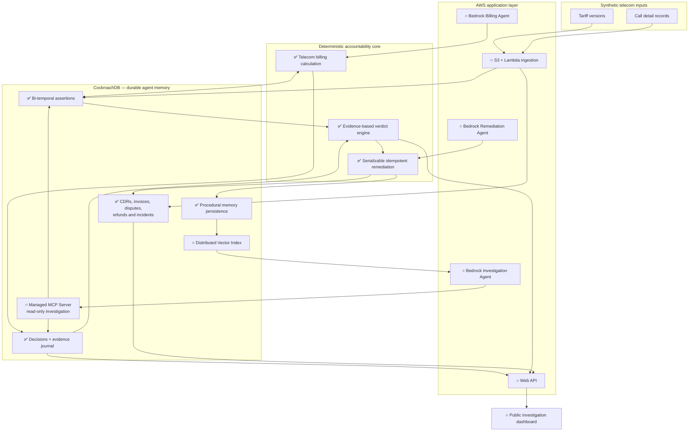

# HindSight

**Temporal Decision Accountability for AI Agents**

HindSight reconstructs what was true, what an agent could know, what evidence it used,
and whether its decision was reasonable at that moment. The reference workflow audits a
synthetic telecom billing dispute caused by a late retroactive tariff.

## Current milestone

This repository currently implements the deterministic P0 foundation:

- generic bi-temporal assertions;
- append-only fact versions with supersession metadata;
- parameterized CockroachDB truth and knowledge queries;
- a telecom domain adapter that calculates billing without an LLM;
- an idempotent decision journal with explicit availability, retrieval, presentation,
  and usage evidence;
- a deterministic accountability verdict derived from that evidence;
- a serializable, idempotent remediation that corrects the invoice, creates one refund,
  closes the dispute, and opens one ingestion incident atomically;
- procedural memory written in the same CockroachDB transaction;
- idempotent demo data, focused tests, and a CLI proof with a safe replay.

The demo proves that a EUR 0.15 rate is current truth while the billing agent could only
know and select the EUR 0.25 rate on July 2, 2026. The resulting verdict is
`wrong_not_knowable`.

## Run with uv

Requirements: [uv](https://docs.astral.sh/uv/) and Python 3.12–3.14.

```bash
uv sync
uv run hindsight demo
uv run pytest
```

The demo command uses a local in-memory repository so contributors can verify the
domain logic without secrets. It exercises the same service layer used by CockroachDB.

To run the proof against CockroachDB, configure separate schema-owner and least-privilege
runtime URLs in the environment:

```bash
uv run --env-file .env hindsight migrate
uv run --env-file .env hindsight demo --cockroach
```

The explicit `--cockroach` flag prevents a local demo from mutating a database merely
because `DATABASE_URL` exists in the shell. Migration and runtime credentials remain
separate. Run `migrate` again after pulling a new migration; every migration is safe to
replay. Serializable conflicts retry with bounded backoff, while an ambiguous commit is
reconciled through the remediation idempotency key on a fresh connection.

## Temporal model

Each assertion has two independent timelines:

- `valid_from` / `valid_until`: when the fact is true in the business domain;
- `recorded_at` / `superseded_at`: when the system knows that fact.

Corrections insert a new immutable fact version. Existing fact values are never deleted
or overwritten; only their supersession metadata is closed transactionally. Current truth
and knowledge-at-decision-time select the latest recorded version that applies to the
event, using explicit deterministic SQL.

## Architecture and implementation roadmap

Status: ✅ implemented · ▶ next milestone · ○ planned.



The next proof will retrieve procedural memory during a second investigation and measure
whether it improves the workflow. Bedrock agents, Managed MCP and vector retrieval then
follow, before the public API, dashboard, AWS deployment, observability, and access-control
hardening.

## Demo data and safety

NovaTel is fictional. All routes, call records, disputes, and prices are synthetic and do
not allege real overbilling by any operator. No real customer data or PII is used. Secrets
must remain outside the repository; `.env.example` contains placeholders only.

## Pre-existing work disclosure

HindSight is a new project created for the CockroachDB × AWS hackathon. It builds on
lessons learned from UrdWell, an earlier local-memory MCP research project using Parquet.
HindSight's CockroachDB schemas and services, AWS deployment, decision-accountability
core, telecom adapter, agent workflows, interface, KDT benchmark, and demo are separate
hackathon work.

## License

Apache-2.0. See [LICENSE](LICENSE).
