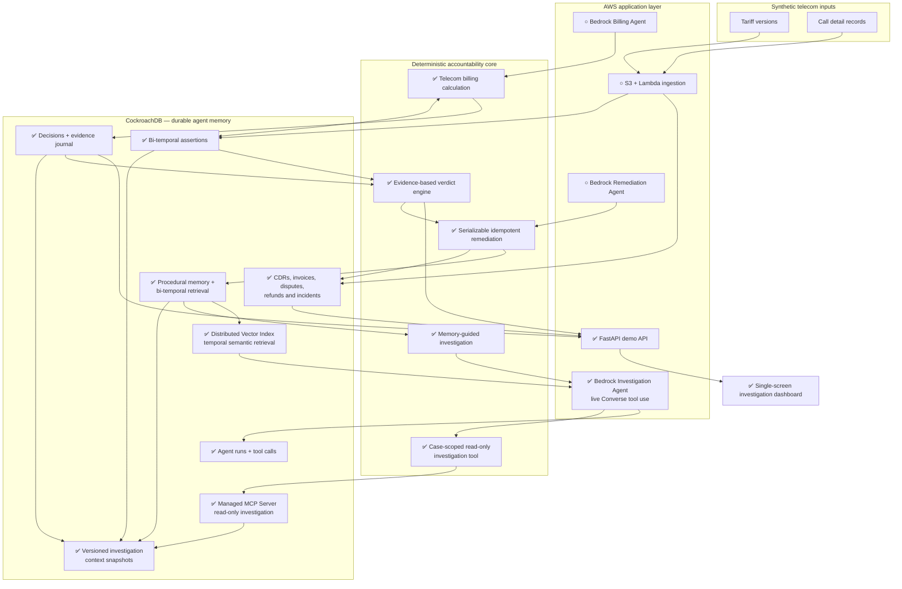

# HindSight

> Judge the decision. Not the hindsight.

**Temporal Decision Accountability for AI Agents**

HindSight reconstructs what was true, what an agent could know, what evidence it used,
and whether its decision was reasonable at that moment. The reference workflow audits a
synthetic telecom billing dispute caused by a late retroactive tariff.

## Current milestone

This repository implements the deterministic P0 foundation, the first bounded
Bedrock investigation slice, and a deployable web demonstration:

- generic bi-temporal assertions;
- append-only fact versions with supersession metadata;
- parameterized CockroachDB truth and knowledge queries;
- a telecom domain adapter that calculates billing without an LLM;
- an idempotent decision journal with explicit availability, retrieval, presentation,
  and usage evidence;
- a deterministic accountability verdict derived from that evidence;
- a serializable, idempotent remediation that corrects the invoice, creates one refund,
  closes the dispute, and opens one ingestion incident atomically;
- procedural memory written in the same CockroachDB transaction;
- bi-temporal procedural retrieval that guides a second, similar investigation without
  changing its deterministic verdict or financial calculation;
- CockroachDB Distributed Vector Index retrieval over Bedrock Titan embeddings, with exact
  domain filters, temporal eligibility checks, similarity scores, and structured fallback;
- a client-side Bedrock Converse tool-use loop with one case-scoped read-only tool;
- an optional CockroachDB Cloud Managed MCP transport that serves that tool through one
  fixed, bounded `select_query` instead of exposing SQL generation to the model;
- durable CockroachDB `agent_runs` and `tool_calls` traces, including bounded inputs,
  results, token usage, stop reasons, and sanitized failures;
- a FastAPI health/demo boundary and one responsive dashboard that renders the decision,
  temporal timelines, evidence, remediation, and before/after memory proof;
- idempotent demo data, focused tests, and a CLI proof with a safe replay.

The demo proves that a EUR 0.15 rate is current truth while the billing agent could only
know and select the EUR 0.25 rate on July 2, 2026. The resulting verdict is
`wrong_not_knowable`. A later dispute on the same route and service retrieves the prior
procedure before its audit, proposes a root cause, and loads four reusable verification
steps. The deterministic audit then confirms the suggestion; memory remains advisory and
is never an input to the verdict or financial calculation.

## Run with uv

Requirements: [uv](https://docs.astral.sh/uv/) and Python 3.12–3.14.

```bash
uv sync
uv run hindsight demo
uv run hindsight serve
uv run pytest
```

The demo command uses a local in-memory repository so contributors can verify the
domain logic without secrets. It exercises the same service layer used by CockroachDB.
The dashboard is then available at `http://127.0.0.1:8000`. It does not mutate on page load:
the explicit **Run the audit** button calls `POST /demo/seed`, which is idempotent and uses
CockroachDB when `DATABASE_URL` is configured. `GET /health` probes the database with `SELECT 1`.
The web replay never invokes billable Bedrock, vector, or MCP operations implicitly; those proofs
remain explicit CLI commands below.

To run the proof against CockroachDB, configure separate schema-owner and least-privilege
runtime URLs in the environment:

```bash
uv run --env-file .env hindsight migrate
uv run --env-file .env hindsight demo --cockroach
```

The explicit `--cockroach` flag prevents a local demo from mutating a database merely
because `DATABASE_URL` exists in the shell. Migration and runtime credentials remain
separate. Run `migrate` again after pulling a new migration; every migration is safe to
replay. Serializable conflicts retry with bounded backoff, while an ambiguous commit is
reconciled through stable remediation or journal identifiers on a fresh connection.

The vector proof is also explicit because it invokes Bedrock Titan and can be billable:

```bash
uv run --env-file .env hindsight demo --cockroach --vector
```

It embeds the immutable procedure after the financial remediation commits, stores the
1,024-dimensional vector in `memory_embeddings`, and retrieves it through the cosine
`memory_embeddings_cosine_idx`. Exact index prefixes restrict domain, namespace, kind,
embedding model, route, and service before ANN search. Bi-temporal eligibility and case
exclusion are applied to a bounded candidate set, expanded once when post-filtering leaves too
few results. Matches below the `0.80` similarity safety floor are rejected; the existing
structured lookup remains a deterministic fallback. Replays do not re-embed an unchanged
stored procedure, while retrieval queries still invoke Titan. Embedding failure cannot roll
back a corrected invoice or refund.

The migration never changes cluster-wide settings. An operator can verify DVI with
`SHOW CLUSTER SETTING feature.vector_index.enabled`; only an administrator should enable it
when required. The application and migration users do not need that cluster privilege.

The Bedrock proof is explicit, durable, and potentially billable. Configure `AWS_REGION`
and `BEDROCK_MODEL_ID`, use the normal AWS SDK credential provider chain, then run:

```bash
uv run --env-file .env hindsight demo --cockroach --bedrock
```

For the complete hackathon proof with both the distributed vector memory and the durable
agent investigation, run:

```bash
uv run --env-file .env hindsight demo --cockroach --vector --bedrock
```

To route the same case-scoped evidence tool through the
[CockroachDB Cloud Managed MCP Server](https://www.cockroachlabs.com/docs/cockroachcloud/connect-to-the-cockroachdb-cloud-mcp-server),
set `COCKROACH_MCP_CLUSTER_ID` and `COCKROACH_MCP_API_KEY` for a dedicated service account,
run the new migration, then add `--mcp`:

```bash
uv run --env-file .env hindsight migrate
uv run --env-file .env hindsight demo --cockroach --vector --bedrock --mcp
```

The deterministic application persists immutable, content-addressed context snapshots, so the
same dispute can safely have distinct structured and vector-memory views. Each agent run records
the exact snapshot ID it was assigned. Bedrock still sees only `get_investigation_context`; the
orchestrator maps it to one `select_query` constrained by that snapshot ID and dispute UUID with
`LIMIT 1`. The MCP response is bounded before parsing and the final tool result remains capped at
64 KB. The API key is never accepted as a CLI argument and should live in AWS Secrets Manager for
deployment.

The command fails closed if the model skips the evidence tool, requests another case,
uses an unknown tool, returns no final explanation, or exceeds the fixed turn/tool
budgets. The model only explains an already computed result: it cannot change a verdict,
amount, invoice, refund, or remediation. The live Nova 2 Lite proof completed with two AWS
request IDs and one successful read-only tool call. The injected scripted client remains in
focused tests for deterministic validation. The advisory answer is requested in at most 220
words and hard-capped at 1,200 output tokens; incomplete provider responses fail closed with
their exact stop reason and durable run ID.
Bedrock itself is not transactionally exactly-once: a new CLI invocation creates a new
audited run, while the only external tool in this milestone is read-only and replay-safe.

## Temporal model

Each assertion has two independent timelines:

- `valid_from` / `valid_until`: when the fact is true in the business domain;
- `recorded_at` / `superseded_at`: when the system knows that fact.

Corrections insert a new immutable fact version. Existing fact values are never deleted
or overwritten; only their supersession metadata is closed transactionally. Current truth
and knowledge-at-decision-time select the latest recorded version that applies to the
event, using explicit deterministic SQL.

## Architecture and implementation roadmap

Status: ✅ implemented · ▶ next milestone · ○ planned.



The next milestone is the public AWS deployment boundary, followed by S3/Lambda ingestion,
observability, and access-control hardening.

## Demo data and safety

NovaTel is fictional. All routes, call records, disputes, and prices are synthetic and do
not allege real overbilling by any operator. No real customer data or PII is used. Secrets
must remain outside the repository; `.env.example` contains placeholders only.

## Pre-existing work disclosure

HindSight is a new project created for the CockroachDB × AWS hackathon. It builds on
lessons learned from UrdWell, an earlier local-memory MCP research project using Parquet.
HindSight's CockroachDB schemas and services, AWS deployment, decision-accountability
core, telecom adapter, agent workflows, interface, KDT benchmark, and demo are separate
hackathon work.

## License

Apache-2.0. See [LICENSE](LICENSE).
