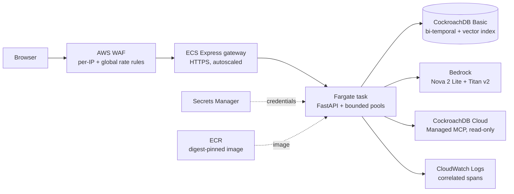
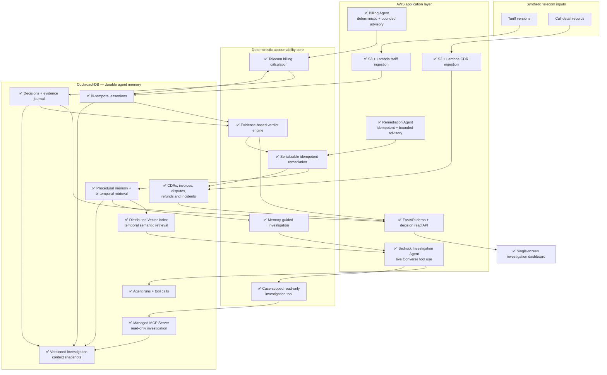

# HindSight

> Judge the decision. Not the hindsight.

**Temporal Decision Accountability for AI Agents**

HindSight reconstructs what was true, what an agent could know, what evidence it used,
and whether its decision was reasonable at that moment. The reference workflow audits a
synthetic telecom billing dispute caused by a late retroactive tariff.

## Live deployment

Running on AWS `eu-central-1`, `showcase` profile, synthetic data only:
**https://hi-cb63ff7571af4e20bd5d23991ee1dc44.ecs.eu-central-1.on.aws**

Commit `bc4e99d2f14e06d4db39c1458a6c8d3c97c2cf3e`, image digest
`sha256:30ee21ed2e58be0a863962bedfab5bb951f1f7b679fdcce202878a45d5a81dd8`. The image is pinned
by digest; no mutable tag is deployed.


```mermaid
flowchart LR
    U[Browser] --> WAF[AWS WAF<br/>per-IP + global rate rules]
    WAF --> GW[ECS Express gateway<br/>HTTPS, autoscaled]
    GW --> TASK[Fargate task<br/>FastAPI + bounded pools]
    TASK --> CRDB[(CockroachDB Basic<br/>bi-temporal + vector index)]
    TASK --> BR[Bedrock<br/>Nova 2 Lite + Titan v2]
    TASK --> MCP[CockroachDB Cloud<br/>Managed MCP, read-only]
    SM[Secrets Manager] -.credentials.-> TASK
    ECR[ECR<br/>digest-pinned image] -.image.-> TASK
    TASK --> CW[CloudWatch Logs<br/>correlated spans]
```

Measured on that deployment:

| | |
|---|---|
| Full audit, `POST /demo/seed`, all providers | **8 520 ms**, status 200 |
| Same audit driven from outside the cluster region | 15 022 ms |
| Warm CockroachDB checkout | 7–32 ms |
| Load-balancer health probe | < 1 ms |
| Memory retrieval method | distributed vector index, rank `#1` |

The 43 % gap between the two audit figures is network distance alone — the same image, cluster
and provider configuration — and it is why the service is deployed beside its database. These
are **single observations, not distributions**: no percentile, throughput, or multi-task figure
is claimed. Full record and limits in
[`evidence/deployment-2026-08-17.md`](evidence/deployment-2026-08-17.md).

## What is implemented

- **Temporal core.** Generic bi-temporal assertions, append-only fact versions with supersession
  metadata, parameterized CockroachDB truth and knowledge-at-decision-time queries, and a telecom
  domain adapter that calculates billing without an LLM.
- **Accountability.** An idempotent decision journal recording availability, retrieval,
  presentation and usage evidence; a deterministic verdict derived from that evidence; and a
  serializable remediation that corrects the invoice, issues one refund, closes the dispute and
  opens one ingestion incident atomically.
- **Memory.** Procedural memory written in the same transaction, bi-temporal retrieval, and
  CockroachDB Distributed Vector Index search over Bedrock Titan embeddings with domain filters,
  temporal eligibility, similarity scores and structured fallback. Memory stays advisory — never
  an input to the verdict or the financial calculation.
- **Agents.** A bounded three-agent workflow sharing one correlation ID, a client-side Bedrock
  Converse tool-use loop with a single case-scoped read-only tool, an optional CockroachDB Cloud
  Managed MCP transport serving that tool through one fixed `select_query`, and durable
  `agent_runs`/`tool_calls` traces with bounded inputs, token usage and sanitized failures.
- **Web and deployment.** A FastAPI boundary with bounded decision/truth/knowledge/evidence/verdict
  reads, a responsive dashboard rendering the before/after memory proof, a non-root Python 3.12
  container deployed by digest to ECS Express Mode, CockroachDB-backed demo workspace state with
  versioned transitions and expiring leases, and lazy bounded connection pools.
- **Safety and operations.** Layered abuse protection (WAF, local buckets, shared quotas, provider
  budgets, concurrency leases, anonymized identities, stable `429`/`503` contracts), correlated
  performance spans reducible to a sanitized offline report, private encrypted S3 tariff and CDR
  intakes with image-based Lambdas and SHA-256 provenance, a 35-scenario Knowledge-at-Decision-Time
  benchmark, a bounded operational preflight, and idempotent demo data with a safe replay.

The demo proves that a EUR 0.15 rate is current truth while the billing agent could only know and
select the EUR 0.25 rate on July 2, 2026 — verdict `wrong_not_knowable`. A later dispute on the
same route retrieves the prior procedure before its audit, proposes a root cause and loads four
reusable verification steps; the deterministic audit then confirms the suggestion.

## Run with uv

Requirements: [uv](https://docs.astral.sh/uv/) and Python 3.12–3.14.

```bash
uv sync
uv run hindsight demo
uv run hindsight serve
uv run pytest
```

The demo command uses a local in-memory repository so contributors can verify the
domain logic without secrets. It exercises the same service layer used by CockroachDB.
The dashboard is then available at `http://127.0.0.1:8000`. It does not mutate on page load:
`GET /demo/workspace` only reads the explicit demo queue and completed audits. An empty
register exposes no audit action. `POST /demo/prepare` loads one synthetic report without
running the workflow; only then can **Run the audit** claim it through the guarded,
single-flight `POST /demo/seed`. The underlying workflow remains idempotent and uses
CockroachDB when `DATABASE_URL` is configured.
If the fixed sample decision already exists in audit history, the interface labels the
operation as a replay instead of presenting it as a new incident. Use the in-memory server
or an isolated database when demonstrating a genuinely fresh `0 -> 1 -> 0` queue transition.
`GET /health` is a dependency-free liveness endpoint; `GET /ready` probes both the
application database and the distributed limiter tables. The read API exposes
`GET /decisions/{id}` plus `/truth`, `/knowledge`, `/evidence`, and `/verdict`; all reads
are parameterized, bounded, redacted, and returned with `Cache-Control: no-store`.
`GET /memories/search` derives the CockroachDB namespace from a server-side agent policy,
caps results at 20, and returns `503` when durable memory is not configured.

The web replay never invokes billable Bedrock, vector, or MCP operations implicitly. A
deployed service enables them only when the corresponding `HINDSIGHT_DEMO_BEDROCK`,
`HINDSIGHT_DEMO_VECTOR`, and `HINDSIGHT_DEMO_MCP` flags are explicitly `true`. Startup
rejects incomplete combinations instead of silently presenting a partial proof. The CLI
commands below remain the fastest way to verify each integration independently.

To run the proof against CockroachDB, configure separate schema-owner and least-privilege
runtime URLs in the environment:

```bash
uv run --env-file .env hindsight migrate
uv run --env-file .env hindsight demo --cockroach
```

The explicit `--cockroach` flag prevents a local demo from mutating a database merely
because `DATABASE_URL` exists in the shell. Migration and runtime credentials remain
separate. Run `migrate` again after pulling a new migration; every migration is safe to
replay. Serializable conflicts retry with bounded backoff, while an ambiguous commit is
reconciled through stable remediation or journal identifiers on a fresh connection.

The vector proof is also explicit because it invokes Bedrock Titan and can be billable:

```bash
uv run --env-file .env hindsight demo --cockroach --vector
```

It embeds the immutable procedure after the financial remediation commits, stores the
1,024-dimensional vector in `memory_embeddings`, and retrieves it through the cosine
`memory_embeddings_cosine_idx`. Exact index prefixes restrict domain, namespace, kind,
embedding model, route, and service before ANN search. Bi-temporal eligibility and case
exclusion are applied to a bounded candidate set, expanded once when post-filtering leaves too
few results. Matches below the `0.80` similarity safety floor are rejected; the existing
structured lookup remains a deterministic fallback. Replays do not re-embed an unchanged
stored procedure, while retrieval queries still invoke Titan. Embedding failure cannot roll
back a corrected invoice or refund.

The migration never changes cluster-wide settings. An operator can verify DVI with
`SHOW CLUSTER SETTING feature.vector_index.enabled`; only an administrator should enable it
when required. The application and migration users do not need that cluster privilege.

The Bedrock proof is explicit, durable, and potentially billable. Configure `AWS_REGION`
and `BEDROCK_MODEL_ID`, use the normal AWS SDK credential provider chain, then run:

```bash
uv run --env-file .env hindsight demo --cockroach --bedrock
```

For the complete hackathon proof with both the distributed vector memory and the durable
agent investigation, run:

```bash
uv run --env-file .env hindsight demo --cockroach --vector --bedrock
```

To route the same case-scoped evidence tool through the
[CockroachDB Cloud Managed MCP Server](https://www.cockroachlabs.com/docs/cockroachcloud/connect-to-the-cockroachdb-cloud-mcp-server),
set `COCKROACH_MCP_CLUSTER_ID` and `COCKROACH_MCP_API_KEY` for a dedicated service account,
run the new migration, then add `--mcp`:

```bash
uv run --env-file .env hindsight migrate
uv run --env-file .env hindsight demo --cockroach --vector --bedrock --mcp
```

The deterministic application persists immutable, content-addressed context snapshots, so the
same dispute can safely have distinct structured and vector-memory views. Each agent run records
the exact snapshot ID it was assigned. Bedrock still sees only `get_investigation_context`; the
orchestrator maps it to one `select_query` constrained by that snapshot ID and dispute UUID with
`LIMIT 1`. The MCP response is bounded before parsing and the final tool result remains capped at
64 KB. The API key is never accepted as a CLI argument and should live in AWS Secrets Manager for
deployment.

The command fails closed if the model skips the evidence tool, requests another case,
uses an unknown tool, returns no final explanation, or exceeds the fixed turn/tool
budgets. The model only explains an already computed result: it cannot change a verdict,
amount, invoice, refund, or remediation. The live Nova 2 Lite proof completed with two AWS
request IDs and one successful read-only tool call. The injected scripted client remains in
focused tests for deterministic validation. The advisory answer is requested in at most 220
words and hard-capped at 1,200 output tokens; incomplete provider responses fail closed with
their exact stop reason and durable run ID.
Bedrock itself is not transactionally exactly-once: a new CLI invocation creates a new
audited run, while the only external tool in this milestone is read-only and replay-safe.

## Container and ECS Express Mode boundary

HindSight targets [Amazon ECS Express Mode](https://docs.aws.amazon.com/AmazonECS/latest/developerguide/express-service-overview.html)
rather than App Runner, which AWS has closed to new customers. Express Mode is available to new
accounts, provisions the Fargate service, HTTPS load balancer, networking and autoscaling from
one immutable image, and leaves every generated resource visible in the account for review. WAF
protects the load balancer, Secrets Manager injects runtime credentials, and the task role is
restricted to the declared Bedrock ARNs and secrets. There is no Express Mode surcharge.

`deploy/ecr-bootstrap.yaml` creates the encrypted, scan-on-push ECR repository with immutable
tags. `deploy/ecs-express-service.yaml` creates a two-AZ VPC, the ECS cluster, three separate
IAM roles, a generated HMAC secret, retained logs, the service and its WAF, plus alarms and a
dashboard when enhanced observability is enabled. The image parameter accepts only a URI pinned
by `sha256` digest.

Each replacement task validates the application pool and the distributed rate-limit tables
before serving. `/health` stays dependency-free so a transient database outage cannot trigger a
restart storm; `/ready` is the explicit dependency probe. Migrations run separately with the
schema-owner credential — the ECS task never receives `MIGRATION_DATABASE_URL`.

**The full parameter contract, deployment order, grants and evidence checklist are in
[`deploy/README.md`](deploy/README.md).**

### Deployment profiles and tenant boundary

| Profile | Purpose | Capacity and access |
|---|---|---|
| `showcase` | Public synthetic demonstration, bounded idle cost | Fixed at one task; API key optional; WAF, shared quotas, provider budgets, concurrency leases and reset-token protection stay active. |
| `production` | One organization, highly available | CloudFormation rejects single-task or inverted capacity, and requires `ApplicationApiKeySecretArn` plus enhanced observability. Business routes and `/ready` require the Bearer token; `/health` and the data-free dashboard shell stay public. |

The production boundary is **one isolated stack per organization** — its own runtime secret,
database scope, WAF, logs, quotas, roles and application key. No client-supplied `agent_id` or
organization identifier grants cross-namespace access. The built-in browser page remains a
data-free showcase shell and never embeds the deployment-wide key.

The shared `demo_workspaces` state machine persists `empty`/`prepared`/`running`/`completed`
transitions, a version and an expiring owner lease in CockroachDB. Atomic claims stop two
replicas executing the same prepared workspace, and an expired lease is reclaimable after a task
dies. Each task uses a lazy, bounded business pool (zero warm connections, five maximum,
two-second checkout timeout) and holds a connection only around a repository operation, so
provider latency never reserves one. The limiter has its own five-connection bulkhead, giving a
hard ceiling of `MaxTaskCount × (DatabasePoolMaxSize + RateLimitPoolMaxSize)`. Server concurrency,
backlog and graceful shutdown are bounded too, so overload is rejected rather than queued. A long
synchronous audit can still outlive the drain: durable state and expiring leases make that
recoverable, but do not promise uninterrupted in-flight work.

`ProviderConcurrency` is a **fleet-wide** ceiling, not per task — the lease lives in CockroachDB
under one key shared by every replica. Raising `MaxTaskCount` therefore adds request and database
capacity but no provider capacity, which is what keeps provider spend bounded independently of
scale. A task that dies mid-audit keeps its slot until the lease expires, so fleet provider
capacity can stay reduced for up to the TTL (600 s, derived from the provider timeouts) after a
crash or rolling replacement. Provisioning above steady-state need absorbs that window.

### Rate limiting and public abuse protection

Protection is layered: AWS WAF reputation/known-bad-input/common groups plus three edge rate
rules (300 req/min per IP, 10 req/min per IP on the expensive routes, 120 expensive req/min
globally), then bounded local token buckets, then CockroachDB-shared quotas, provider spend
budgets and concurrency leases. Application quotas remain necessary because WAF rate rules are
approximate and cannot account for the several provider calls inside one accepted request.

| Scope | Refill rate | Burst |
|---|---:|---:|
| local fallback, per client/process | 180/min | 30 |
| all API traffic, global | 600/min | 100 |
| decision/workspace reads, per client | 60/min | 15 |
| unsafe methods, per client | 10/min and 60/hour | 3 and 10 |
| memory search, per client/global | 12/min and 120/min | 3 and 20 |
| seed attempts, per client | 6/min | 2 |
| accepted seed execution, per client/global | 2/10 min and 12/hour | 1 and 1 |
| reset attempts / authorized resets | 3/hour per client, 10/hour global | 1 and 1 |
| provider credits, per client/global | 32/hour and 160/hour | 8 and 24 |
| live provider concurrency, global | 4 active leases | 10-minute crash expiry |

A provider-enabled demo execution costs eight credits, a vector memory search one. Credits are
taken only after route, authorization and demo-state validation, so malformed requests cannot
drain the budget. Provider routes take a concurrency lease **before** spending non-refundable
credits, and release it immediately if the budget check then fails — a request rejected for lack
of capacity never burns spend. Bedrock and embedding clients set explicit connect, read and retry
limits; that bounded worst case is what keeps a lease from expiring mid-call.

Rejections return `429` with `Retry-After` and `RateLimit-*` headers. A limiter failure returns
`503` before any provider is invoked, and an exhausted business pool returns
`503 database_capacity_unavailable`, so saturation is measurable as shed load instead of hiding
in the generic `500` rate. `/health` is exempt from application limits — it carries no forwarded
address and would otherwise share a bucket with unparseable traffic, letting that traffic
deregister the task.

Client identities are stored only as HMAC-SHA256 values; set `HINDSIGHT_RATE_LIMIT_HMAC_KEY` to
at least 32 random bytes in Secrets Manager. Forwarded headers are ignored unless trusted proxy
hops *and* CIDRs are configured, IPv6 clients group by `/64`, and Uvicorn's implicit proxy
rewriting is disabled. WAF logs retain blocked *and* counted requests so `ManagedRulesMode=COUNT`
is observable, with query strings, authorization, cookies and the reset-token header redacted.

`HINDSIGHT_RATE_LIMIT_SCALE` (`0.1`–`10`) and `HINDSIGHT_PROVIDER_CONCURRENCY` (1–64) retune
capacity without rebuilding the image. The stack exposes no switch to disable WAF or the
Cockroach-backed limiter. `POST /demo/reset` is absent unless `HINDSIGHT_DEMO_RESET_TOKEN` is
configured; when enabled it cannot race an active audit and deletes only the fixed synthetic
fixture identifiers in one transaction.

## S3 and Lambda ingestion

### Tariff versions

`deploy/tariff-ingestion.yaml` provisions a private, encrypted, versioned bucket, an
image-based Lambda, bounded async retries, and an encrypted SQS failure queue. Build
`Dockerfile.lambda`, publish the immutable image to ECR, then deploy the stack:

```powershell
docker build -f Dockerfile.lambda -t hindsight-tariff-ingestion:demo .
aws cloudformation deploy `
  --template-file deploy/tariff-ingestion.yaml `
  --stack-name hindsight-tariff-ingestion `
  --capabilities CAPABILITY_IAM `
  --parameter-overrides TariffBucketName=<unique-name> `
    LambdaImageUri=<ecr-image-uri>@sha256:<digest> DatabaseSecretArn=<secret-arn>
```

Upload UTF-8 files under `tariffs/*.csv` with this exact header:

```csv
assertion_key,route,service_type,value,currency,unit,valid_from,recorded_at,source
```

After deployment, the included fixture exercises a separate route without colliding with
the main decision demo:

```powershell
aws s3 cp examples/tariffs/demo-rates.csv s3://<bucket-name>/tariffs/demo-rates.csv
```

The stack accepts only the explicit byte caps `100000`, `500000`, `1000000`, or `2000000` and
row caps `100`, `500`, `1000`, `5000`, or `10000`; the defaults are 2 MB and 10,000 rows.
Parsing, hashing, validation, and preparation are O(bytes + rows); each row is then appended
once. S3 delivery is still at-least-once and unordered, so the content checksum and database
constraints provide idempotence while older backfills fail into the queue for review.

### Synthetic CDRs

`deploy/cdr-ingestion.yaml` provisions the equivalent isolated boundary for voice CDRs. It
reuses the Lambda image and overrides its handler, so one immutable image can back both stacks:

```powershell
aws cloudformation deploy `
  --template-file deploy/cdr-ingestion.yaml `
  --stack-name hindsight-cdr-ingestion `
  --capabilities CAPABILITY_IAM `
  --parameter-overrides CdrBucketName=<unique-name> `
    LambdaImageUri=<ecr-image-uri>@sha256:<digest> DatabaseSecretArn=<secret-arn>
aws s3 cp examples/cdrs/demo-cdrs.csv s3://<bucket-name>/cdrs/demo-cdrs.csv
```

The exact header is:

```csv
external_id,msisdn_hash,route,service_type,started_at,duration_sec
```

Only synthetic voice rows are accepted. `msisdn_hash` must be a lowercase 64-character
SHA-256 value and duration must be between 1 and 86,400 seconds. Object parsing is
O(bytes + rows); the object checksum and stable external IDs make repeated S3 delivery a
database-level no-op. The CDR stack enforces the same explicit byte and row-cap choices as the
tariff stack.

Both ingestion stacks let CloudFormation generate a stack-scoped Lambda name, require an image
pinned by digest, and default to one worker. `ReservedConcurrency` can be selected only from
`1`, `2`, `4`, `8`, or `16`; raise it only after checking Lambda cost and confirming that the
CockroachDB connection/write budget can absorb the same number of parallel invocations.

## Knowledge-at-Decision-Time benchmark

Run the committed synthetic regression benchmark without cloud credentials:

```bash
uv run python -m hindsight.benchmarks.kdt
```

`kdt-synthetic-v1` contains 35 controlled scenarios across seven verdict families. The
committed `benchmarks/kdt/results.json` reports 100% truth, knowledge, retrieval, verdict,
root-cause, provenance, idempotence, and procedural-memory reuse accuracy; unjustified blame
and duplicate remediation are both 0%. These results measure deterministic fixture coverage,
not external model quality.

## Operational preflight

The default preflight is local and performs only bounded filesystem/tool checks:

```bash
uv run python scripts/ops_preflight.py --json
uv run python scripts/ops_preflight.py --mode live --json
```

Live mode checks that the deployment CLIs, runtime flags, and required environment variable
names are present. It does not contact CockroachDB or AWS and never prints secret values;
actual connectivity remains a separate, explicit deployment step.

## Performance evidence

Every HTTP response carries an `X-Correlation-ID`. Structured `request_complete` events record
the method, normalized route, status, server-side handling duration, and UTC completion time;
bounded `performance_span` events use the same correlation ID for workflow, CockroachDB checkout,
Bedrock Converse, Titan embedding, memory retrieval, and managed MCP operations. Span labels are
code-defined and the events never include prompts, SQL, credentials, exception messages, or
request bodies.

[`scripts/performance_evidence.py`](scripts/performance_evidence.py) turns an explicitly bounded
local JSONL export into deterministic request and component counts plus p50/p95/p99 durations.
It rejects empty captures, events outside the declared UTC window, request counts above the
declared cap, and spans not linked to a completed request. It performs no network, AWS,
CockroachDB, or load-generation work. The exact authorization, capture, sanitization, and
reproducibility procedure is in
[`evidence/performance/README.md`](evidence/performance/README.md). No production performance
figures are claimed in this README until an authorized run has produced a reviewed report.

### Deployed run

One authorized deployment has been performed and recorded in
[`evidence/deployment-2026-08-17.md`](evidence/deployment-2026-08-17.md): `eu-central-1`,
`showcase` profile, commit `bc4e99d`, image digest `sha256:30ee21ed…`, with Bedrock, vector
retrieval and managed MCP enabled. A full audit executed on the deployed service reproduced the
learning proof — reused cases `0 -> 1`, four procedural steps loaded, recommendation changed —
with the retrieval method reported as the CockroachDB distributed vector index at rank `#1`.

One full audit completed on the deployed service in **8 520 ms**, against 15 022 ms for the same
image and cluster driven from a developer machine outside the cluster region. That 43 % gap is
network distance alone, and it is why the service is deployed beside its database.

That record lists the individual durations observed in the deployed service's logs and names
what remains unmeasured. Those durations are **single observations, not distributions**. In
particular, **no percentile, throughput, or multi-task figure is claimed**: the showcase profile
runs a single task, and the p50/p95/p99 report requires an exported capture processed by the
offline analyzer above.

## Temporal model

Each assertion has two independent timelines:

- `valid_from` / `valid_until`: when the fact is true in the business domain;
- `recorded_at` / `superseded_at`: when the system knows that fact.

Corrections insert a new immutable fact version. Existing fact values are never deleted
or overwritten; only their supersession metadata is closed transactionally. Current truth
and knowledge-at-decision-time select the latest recorded version that applies to the
event, using explicit deterministic SQL.

## Architecture and implementation roadmap

Status: ✅ implemented · ▶ next milestone · ○ planned.


```mermaid
flowchart TB
    subgraph INPUTS["Synthetic telecom inputs"]
        TARIFFS["Tariff versions"]
        CDRS["Call detail records"]
    end

    subgraph AWS["AWS application layer"]
        INGEST["✅ S3 + Lambda tariff ingestion"]
        CDR_INGEST["✅ S3 + Lambda CDR ingestion"]
        BILLING_AGENT["✅ Billing Agent<br/>deterministic + bounded advisory"]
        INVESTIGATION_AGENT["✅ Bedrock Investigation Agent<br/>live Converse tool use"]
        REMEDIATION_AGENT["✅ Remediation Agent<br/>idempotent + bounded advisory"]
        API["✅ FastAPI demo + decision read API"]
    end

    subgraph CORE["Deterministic accountability core"]
        BILLING["✅ Telecom billing calculation"]
        VERDICT["✅ Evidence-based verdict engine"]
        REMEDIATION["✅ Serializable idempotent remediation"]
        GUIDANCE["✅ Memory-guided investigation"]
        CONTEXT_TOOL["✅ Case-scoped read-only<br/>investigation tool"]
    end

    subgraph CRDB["CockroachDB — durable agent memory"]
        ASSERTIONS["✅ Bi-temporal assertions"]
        JOURNAL["✅ Decisions + evidence journal"]
        OPERATIONS["✅ CDRs, invoices, disputes,<br/>refunds and incidents"]
        MEMORY["✅ Procedural memory +<br/>bi-temporal retrieval"]
        AGENT_JOURNAL["✅ Agent runs + tool calls"]
        CONTEXT_SNAPSHOT["✅ Versioned investigation<br/>context snapshots"]
        VECTOR["✅ Distributed Vector Index<br/>temporal semantic retrieval"]
        MCP["✅ Managed MCP Server<br/>read-only investigation"]
    end

    DASHBOARD["✅ Single-screen investigation dashboard"]

    TARIFFS --> INGEST
    CDRS --> CDR_INGEST
    INGEST --> ASSERTIONS
    CDR_INGEST --> OPERATIONS

    BILLING_AGENT --> BILLING
    BILLING <--> ASSERTIONS
    BILLING --> JOURNAL

    INVESTIGATION_AGENT --> CONTEXT_TOOL
    INVESTIGATION_AGENT --> AGENT_JOURNAL
    CONTEXT_TOOL --> MCP
    MCP --> CONTEXT_SNAPSHOT
    ASSERTIONS --> CONTEXT_SNAPSHOT
    JOURNAL --> CONTEXT_SNAPSHOT
    MEMORY --> CONTEXT_SNAPSHOT
    ASSERTIONS --> VERDICT
    JOURNAL --> VERDICT

    VERDICT --> REMEDIATION
    REMEDIATION_AGENT --> REMEDIATION
    REMEDIATION --> OPERATIONS
    REMEDIATION --> MEMORY
    MEMORY --> GUIDANCE
    GUIDANCE --> INVESTIGATION_AGENT
    MEMORY --> VECTOR
    VECTOR --> INVESTIGATION_AGENT

    JOURNAL --> API
    VERDICT --> API
    OPERATIONS --> API
    API --> DASHBOARD
```

The repository contains the application, migrations, CI checks, and AWS infrastructure needed
for a bounded showcase or an isolated highly available organization stack. A release is accepted
only when its own immutable image digest, migration state, stack outputs, public probes, access
control, WAF behavior, alarms, and correlated traces have been captured. Until that evidence is
recorded for a specific environment, the repository makes no availability, scale, latency, or
throughput claim about that environment.

## Demo data and safety

NovaTel is fictional. All routes, call records, disputes, and prices are synthetic and do
not allege real overbilling by any operator. No real customer data or PII is used. Secrets
must remain outside the repository; `.env.example` contains placeholders only.

## Pre-existing work disclosure

HindSight is a new project created for the CockroachDB × AWS hackathon. It builds on
lessons learned from UrdWell, an earlier local-memory MCP research project using Parquet.
HindSight's CockroachDB schemas and services, AWS deployment, decision-accountability
core, telecom adapter, agent workflows, interface, KDT benchmark, and demo are separate
hackathon work.

## License

Apache-2.0. See [LICENSE](LICENSE).
