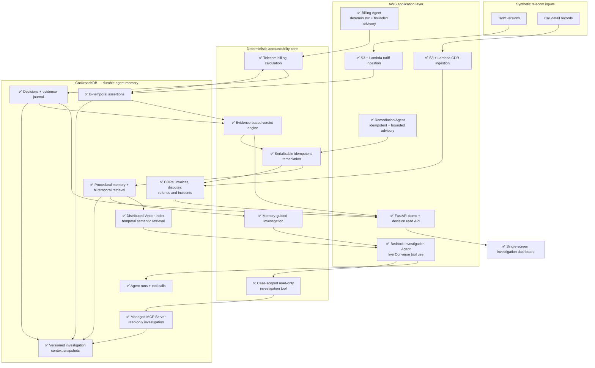

# HindSight

> Judge the decision. Not the hindsight.

**Temporal Decision Accountability for AI Agents**

HindSight reconstructs what was true, what an agent could know, what evidence it used,
and whether its decision was reasonable at that moment. The reference workflow audits a
synthetic telecom billing dispute caused by a late retroactive tariff.

## Current milestone

This repository implements the deterministic P0 foundation, a bounded three-agent
workflow, and deployable AWS boundaries for the web application and ingestion:

- generic bi-temporal assertions;
- append-only fact versions with supersession metadata;
- parameterized CockroachDB truth and knowledge queries;
- a telecom domain adapter that calculates billing without an LLM;
- an idempotent decision journal with explicit availability, retrieval, presentation,
  and usage evidence;
- a deterministic accountability verdict derived from that evidence;
- a serializable, idempotent remediation that corrects the invoice, creates one refund,
  closes the dispute, and opens one ingestion incident atomically;
- procedural memory written in the same CockroachDB transaction;
- bi-temporal procedural retrieval that guides a second, similar investigation without
  changing its deterministic verdict or financial calculation;
- CockroachDB Distributed Vector Index retrieval over Bedrock Titan embeddings, with exact
  domain filters, temporal eligibility checks, similarity scores, and structured fallback;
- a client-side Bedrock Converse tool-use loop with one case-scoped read-only tool;
- Billing and Remediation agents that keep all calculations and mutations deterministic,
  use Bedrock only for bounded advisory English, and share one correlation ID with the
  Investigation Agent;
- an optional CockroachDB Cloud Managed MCP transport that serves that tool through one
  fixed, bounded `select_query` instead of exposing SQL generation to the model;
- durable CockroachDB `agent_runs` and `tool_calls` traces, including bounded inputs,
  results, token usage, stop reasons, and sanitized failures;
- a FastAPI health/demo boundary, bounded decision/truth/knowledge/evidence/verdict reads,
  and one responsive dashboard that renders the decision, temporal timelines, evidence,
  remediation, and before/after memory proof;
- a non-root Python 3.12 container selected for an ECR-to-ECS Express Mode deployment,
  with a health check, bounded demo scaling, runtime secrets, and structured request logs;
- layered public abuse protection with AWS WAF per-IP rules, bounded local token buckets,
  CockroachDB-shared quotas, provider-cost budgets, anonymized client identities, and stable
  `429`/`503` contracts;
- private, encrypted, versioned S3 tariff and CDR intakes with image-based Lambdas,
  bounded validation, SHA-256 provenance, idempotent writes, failure queues, and
  single-worker backpressure;
- a reproducible 35-scenario Knowledge-at-Decision-Time regression benchmark;
- a bounded local/live operational preflight that never prints credential values;
- idempotent demo data, focused tests, and a CLI proof with a safe replay.

The demo proves that a EUR 0.15 rate is current truth while the billing agent could only
know and select the EUR 0.25 rate on July 2, 2026. The resulting verdict is
`wrong_not_knowable`. A later dispute on the same route and service retrieves the prior
procedure before its audit, proposes a root cause, and loads four reusable verification
steps. The deterministic audit then confirms the suggestion; memory remains advisory and
is never an input to the verdict or financial calculation.

## Run with uv

Requirements: [uv](https://docs.astral.sh/uv/) and Python 3.12–3.14.

```bash
uv sync
uv run hindsight demo
uv run hindsight serve
uv run pytest
```

The demo command uses a local in-memory repository so contributors can verify the
domain logic without secrets. It exercises the same service layer used by CockroachDB.
The dashboard is then available at `http://127.0.0.1:8000`. It does not mutate on page load:
`GET /demo/workspace` only reads the explicit demo queue and completed audits. An empty
register exposes no audit action. `POST /demo/prepare` loads one synthetic report without
running the workflow; only then can **Run the audit** claim it through the guarded,
single-flight `POST /demo/seed`. The underlying workflow remains idempotent and uses
CockroachDB when `DATABASE_URL` is configured.
If the fixed sample decision already exists in audit history, the interface labels the
operation as a replay instead of presenting it as a new incident. Use the in-memory server
or an isolated database when demonstrating a genuinely fresh `0 -> 1 -> 0` queue transition.
`GET /health` is a dependency-free liveness endpoint; `GET /ready` probes both the
application database and the distributed limiter tables. The read API exposes
`GET /decisions/{id}` plus `/truth`, `/knowledge`, `/evidence`, and `/verdict`; all reads
are parameterized, bounded, redacted, and returned with `Cache-Control: no-store`.
`GET /memories/search` derives the CockroachDB namespace from a server-side agent policy,
caps results at 20, and returns `503` when durable memory is not configured.

The web replay never invokes billable Bedrock, vector, or MCP operations implicitly. A
deployed service enables them only when the corresponding `HINDSIGHT_DEMO_BEDROCK`,
`HINDSIGHT_DEMO_VECTOR`, and `HINDSIGHT_DEMO_MCP` flags are explicitly `true`. Startup
rejects incomplete combinations instead of silently presenting a partial proof. The CLI
commands below remain the fastest way to verify each integration independently.

To run the proof against CockroachDB, configure separate schema-owner and least-privilege
runtime URLs in the environment:

```bash
uv run --env-file .env hindsight migrate
uv run --env-file .env hindsight demo --cockroach
```

The explicit `--cockroach` flag prevents a local demo from mutating a database merely
because `DATABASE_URL` exists in the shell. Migration and runtime credentials remain
separate. Run `migrate` again after pulling a new migration; every migration is safe to
replay. Serializable conflicts retry with bounded backoff, while an ambiguous commit is
reconciled through stable remediation or journal identifiers on a fresh connection.

The vector proof is also explicit because it invokes Bedrock Titan and can be billable:

```bash
uv run --env-file .env hindsight demo --cockroach --vector
```

It embeds the immutable procedure after the financial remediation commits, stores the
1,024-dimensional vector in `memory_embeddings`, and retrieves it through the cosine
`memory_embeddings_cosine_idx`. Exact index prefixes restrict domain, namespace, kind,
embedding model, route, and service before ANN search. Bi-temporal eligibility and case
exclusion are applied to a bounded candidate set, expanded once when post-filtering leaves too
few results. Matches below the `0.80` similarity safety floor are rejected; the existing
structured lookup remains a deterministic fallback. Replays do not re-embed an unchanged
stored procedure, while retrieval queries still invoke Titan. Embedding failure cannot roll
back a corrected invoice or refund.

The migration never changes cluster-wide settings. An operator can verify DVI with
`SHOW CLUSTER SETTING feature.vector_index.enabled`; only an administrator should enable it
when required. The application and migration users do not need that cluster privilege.

The Bedrock proof is explicit, durable, and potentially billable. Configure `AWS_REGION`
and `BEDROCK_MODEL_ID`, use the normal AWS SDK credential provider chain, then run:

```bash
uv run --env-file .env hindsight demo --cockroach --bedrock
```

For the complete hackathon proof with both the distributed vector memory and the durable
agent investigation, run:

```bash
uv run --env-file .env hindsight demo --cockroach --vector --bedrock
```

To route the same case-scoped evidence tool through the
[CockroachDB Cloud Managed MCP Server](https://www.cockroachlabs.com/docs/cockroachcloud/connect-to-the-cockroachdb-cloud-mcp-server),
set `COCKROACH_MCP_CLUSTER_ID` and `COCKROACH_MCP_API_KEY` for a dedicated service account,
run the new migration, then add `--mcp`:

```bash
uv run --env-file .env hindsight migrate
uv run --env-file .env hindsight demo --cockroach --vector --bedrock --mcp
```

The deterministic application persists immutable, content-addressed context snapshots, so the
same dispute can safely have distinct structured and vector-memory views. Each agent run records
the exact snapshot ID it was assigned. Bedrock still sees only `get_investigation_context`; the
orchestrator maps it to one `select_query` constrained by that snapshot ID and dispute UUID with
`LIMIT 1`. The MCP response is bounded before parsing and the final tool result remains capped at
64 KB. The API key is never accepted as a CLI argument and should live in AWS Secrets Manager for
deployment.

The command fails closed if the model skips the evidence tool, requests another case,
uses an unknown tool, returns no final explanation, or exceeds the fixed turn/tool
budgets. The model only explains an already computed result: it cannot change a verdict,
amount, invoice, refund, or remediation. The live Nova 2 Lite proof completed with two AWS
request IDs and one successful read-only tool call. The injected scripted client remains in
focused tests for deterministic validation. The advisory answer is requested in at most 220
words and hard-capped at 1,200 output tokens; incomplete provider responses fail closed with
their exact stop reason and durable run ID.
Bedrock itself is not transactionally exactly-once: a new CLI invocation creates a new
audited run, while the only external tool in this milestone is read-only and replay-safe.

## Container and ECS Express Mode boundary

HindSight uses [Amazon ECS Express Mode](https://docs.aws.amazon.com/AmazonECS/latest/developerguide/express-service-overview.html)
as its target web runtime. App Runner is no longer the deployment target: AWS closed it to
new customers, existing customers can continue to use it, and AWS does not plan to add new
features. AWS recommends ECS Express Mode as the migration path for the same class of
containerized web applications.

### Why ECS Express Mode

- **Available to new AWS accounts.** This keeps the public hackathon deployment reproducible
  for contributors and judges instead of depending on prior App Runner eligibility.
- **Simple managed deployment.** HindSight supplies an immutable container image and IAM roles;
  Express Mode provisions an ECS service on Fargate, an HTTPS Application Load Balancer,
  networking, monitoring, and auto scaling.
- **Visible infrastructure.** The generated ECS, Fargate, load-balancing, networking, and
  CloudWatch resources remain accessible in the project account, which makes security reviews,
  alarms, debugging, and later customization easier than an opaque hosting boundary.
- **Natural AWS security integration.** WAF protects the load balancer, Secrets Manager injects
  runtime credentials, and task roles can be restricted to the selected Bedrock models and
  declared secrets.
- **No Express Mode surcharge.** AWS charges the underlying Fargate, load-balancer, logging,
  data-transfer, and related resources rather than an additional Express Mode fee.
- **A safe growth path.** The hackathon deployment can start with one task while the sample
  intake state remains process-local, then scale horizontally after that state and its
  coordination lock become durable.

The decision follows AWS's
[App Runner availability and migration guidance](https://docs.aws.amazon.com/apprunner/latest/dg/apprunner-availability-change.html).

Build and verify the same image locally before publishing it to a private ECR repository:

```bash
docker build -t hindsight .
docker run --rm -p 8000:8000 --env-file .env hindsight
```

`deploy/ecr-bootstrap.yaml` creates the retained, encrypted, scan-on-push ECR repository with
immutable tags and bounded image retention. `deploy/ecs-express-service.yaml` creates a
dedicated two-AZ VPC, ECS cluster, the three separate IAM roles, a generated 64-character HMAC
secret, retained application and WAF logs, the Express Gateway service, its HTTPS load
balancer association, managed WAF protections, per-IP and global rate rules, and 5xx/latency
alarms. The image parameter accepts only an ECR URI pinned by `sha256` digest. The service is
fixed at one 1-vCPU/2-GB task until the intake queue and coordination lock become durable.

Apply migrations separately with the schema-owner credential; the ECS task must never receive
`MIGRATION_DATABASE_URL`. Application requests are emitted as single-line JSON on stdout for
CloudWatch collection, without bodies or query strings. Bedrock/vector/MCP integrations remain
explicit. When either AWS provider integration is enabled, deployment requires the exact
comma-separated model and inference-profile ARNs; the generated task role receives only
`bedrock:InvokeModel` and `bedrock:GetInferenceProfile` on that list.

### AWS deployment order

1. Choose one AWS Region for ECR, ECS, Secrets Manager, WAF, CloudWatch, and Bedrock. ECS
   Express Mode is available in all AWS Regions, but the selected Bedrock models must also be
   available there or through the chosen inference profile.
2. Create a Secrets Manager secret whose entire value is the least-privilege runtime
   `DATABASE_URL`. Do not use a JSON object and never put `MIGRATION_DATABASE_URL` in ECS.
3. Deploy the ECR bootstrap, build the image, push a unique immutable tag, and retrieve its
   digest:

   ```bash
   aws cloudformation deploy \
     --template-file deploy/ecr-bootstrap.yaml \
     --stack-name hindsight-ecr
   docker build -t hindsight .
   # Authenticate Docker to the RepositoryUri output, tag, and push the image.
   # Pass RepositoryUri@sha256:<digest> to the service stack, never :latest.
   ```

4. Run `hindsight migrate` with the separate schema-owner URL. Migration `011_rate_limits.sql`
   and the documented runtime grants must exist before public traffic is accepted.
5. Deploy the service first with AWS managed WAF groups in `COUNT`, inspect the WAF log, then
   redeploy in `BLOCK` before sharing the URL:

   ```bash
   aws cloudformation deploy \
     --template-file deploy/ecs-express-service.yaml \
     --stack-name hindsight-web \
     --capabilities CAPABILITY_IAM \
     --parameter-overrides \
       ImageIdentifier=<repository-uri>@sha256:<digest> \
       DatabaseSecretArn=<runtime-database-secret-arn> \
       AlertEmail=<operations-email> \
       ManagedRulesMode=COUNT
   ```

6. Confirm the SNS subscription email, verify `/health`, `/ready`, CloudWatch logs, WAF `429`
   responses, and the two alarms. Redeploy with `ManagedRulesMode=BLOCK`, then create an AWS
   Budget with actual and forecast alerts before publishing the endpoint.

The full parameter contract and post-deployment evidence checklist live in
`deploy/README.md`. The stack creates the ECS roles, VPC, generated HMAC key, WAF, and alarms;
the operator supplies only the account/Region, runtime database secret, immutable image,
alert destination, and any explicitly enabled Bedrock or MCP values.

These are deployment artifacts, not evidence that this checkout is already public. A successful
ECR push, CloudFormation deployment, public health check, and CloudWatch trace still have to be
captured in the target AWS account before submission.

The sample intake queue is intentionally process-local, so the ECS Express service must start
with exactly one task. Completed audits remain durable in CockroachDB. Horizontal intake is a
later step and requires a durable reported-cases table and distributed coordination rather
than pretending the demo queue is shared.

### Rate limiting and public abuse protection

Rate limiting is enabled by default and covers every HTTP request, including unknown paths
and methods. The local profile uses a bounded in-memory token bucket. The ECS Express
deployment profile must use CockroachDB-backed buckets so per-client and global limits survive
task restarts and are shared when the service is later scaled beyond one task.
When `DATABASE_URL` is present and no backend override is supplied, startup selects the
Cockroach backend and requires the HMAC key instead of silently falling back to process-local
protection.

The policies are cumulative:

- a local burst guard covers the dashboard, assets, API routes, and 404/405 traffic;
- decision and workspace reads have a shared per-client quota;
- every unsafe HTTP method receives mutation quotas even when a future route has not been
  added to an explicit allowlist;
- memory search and demo execution have stricter per-client and global quotas;
- one provider-enabled demo execution consumes eight provider-budget credits because it can
  invoke several Bedrock Converse and Titan embedding operations, while one vector memory
  search consumes one credit; those credits are acquired only after route, query,
  authorization, and demo-state validation, so malformed or impossible requests cannot drain
  the provider budget;
- Bedrock/Titan work also acquires one of four shared concurrency leases, released in `finally`
  and reclaimed after ten minutes if a process dies;
- reset attempts have a dedicated per-client quota, while the stricter global reset quota is
  acquired only after constant-time token validation so unauthenticated traffic cannot exhaust
  the administrator's global allowance.

Default application policy:

| Scope | Refill rate | Burst |
|---|---:|---:|
| local fallback, per client/process | 180/min | 30 |
| liveness, per client/process | 120/min | 20 |
| all API traffic, global | 600/min | 100 |
| decision/workspace reads, per client | 60/min | 15 |
| unsafe methods, per client | 10/min and 60/hour | 3 and 10 |
| unsafe methods, global | 120/min | 20 |
| memory search, per client/global | 12/min and 120/min | 3 and 20 |
| seed attempts, per client | 6/min | 2 |
| accepted seed execution, per client/global | 2/10 min and 12/hour | 1 and 1 |
| reset attempts / authorized resets | 3/hour per client and 10/hour global | 1 and 1 |
| provider credits, per client/global | 32/hour and 160/hour | 8 and 24 |
| live provider concurrency, global | 4 active leases | 10-minute crash expiry |

Rejected requests return `429` with `Retry-After`, `RateLimit-Limit`,
`RateLimit-Remaining`, and `RateLimit-Reset`. A distributed limiter failure returns `503`
before a protected handler can invoke CockroachDB, Bedrock, Titan, or MCP. `/health` is a
cheap, locally limited liveness check, so a Cockroach outage does not make the container
orchestrator recycle an otherwise diagnosable task. `/ready` is separately and globally
bounded per process and fails if either the application database, bucket table, lease table,
or grants are unusable.

Client identities are stored only as HMAC-SHA256 values. Set
`HINDSIGHT_RATE_LIMIT_HMAC_KEY` to at least 32 random bytes and keep it in Secrets Manager
when `HINDSIGHT_RATE_LIMIT_BACKEND=cockroach`. Forwarded address headers are ignored by
default. They are considered only when both trusted proxy hops and trusted proxy CIDRs are
configured; IPv6 clients are grouped by `/64` to reduce trivial address rotation.
Uvicorn's implicit proxy-header rewriting is disabled, so an untrusted request cannot change
`request.client` merely by sending `X-Forwarded-For`. ECS Express Mode places an Application
Load Balancer in front of the task, so the deployment must configure trusted proxy hops and
CIDRs for the actual load-balancer/VPC boundary. The App Runner-specific trust mode is retained
only for legacy compatibility and must remain disabled in ECS.

The runtime database role needs only the limiter table operations below in addition to its
existing application grants. Replace the example role with the actual runtime principal:

```sql
GRANT SELECT, INSERT, UPDATE
ON TABLE api_rate_limit_buckets
TO hindsight_app;

GRANT SELECT, INSERT, DELETE
ON TABLE api_rate_limit_leases
TO hindsight_app;
```

The ECS Express stack attaches a regional AWS WAF web ACL to the generated Application Load
Balancer. AWS IP-reputation, known-bad-input, and common-protection groups sit in front of
three rate controls: 300 requests/minute per source IP overall, 10 requests/minute per IP for
`POST /demo/seed`, `POST /demo/reset`, and `GET /memories/search`, plus 120 expensive
requests/minute across all clients. WAF metrics are enabled without sampled request bodies.
Encoded and non-normalized paths are transformed before comparison, and edge rejections use the same
`429`/`Retry-After` contract. Only blocked WAF requests are retained in CloudWatch Logs; query
strings, authorization, cookies, and the reset-token header are redacted. The stack generates
and injects a stable 64-character `HINDSIGHT_RATE_LIMIT_HMAC_KEY`.
Application quotas remain necessary because WAF rate rules are approximate and cannot account
for the multiple provider calls performed inside one accepted request.

Useful controls:

```dotenv
HINDSIGHT_RATE_LIMIT_ENABLED=true
HINDSIGHT_RATE_LIMIT_BACKEND=auto
HINDSIGHT_RATE_LIMIT_SCALE=1
HINDSIGHT_RATE_LIMIT_MAX_LOCAL_BUCKETS=50000
HINDSIGHT_RATE_LIMIT_TRUSTED_PROXY_HOPS=0
HINDSIGHT_RATE_LIMIT_TRUST_APP_RUNNER_XFF=false
```

`HINDSIGHT_RATE_LIMIT_SCALE` accepts `0.1` through `10` and changes application capacities
without weakening the separation between route classes. `auto` resolves to CockroachDB when a
database URL exists and to bounded process memory otherwise. The ECS stack does not expose a
switch to disable WAF or the Cockroach-backed application limiter: WAF remains an additional
edge layer, not a replacement for global provider budgets and concurrency leases.

`POST /demo/reset` is absent unless `HINDSIGHT_DEMO_RESET_TOKEN` is configured. When enabled,
it requires that value in `X-Demo-Reset-Token`, cannot race an active audit, and deletes only
the fixed synthetic fixture identifiers in one CockroachDB transaction. The ECS task must
receive the token from a separate Secrets Manager value. Bi-temporal assertions remain
append-only; the next seed safely reuses their stable versions.

## S3 and Lambda ingestion

### Tariff versions

`deploy/tariff-ingestion.yaml` provisions a private, encrypted, versioned bucket, an
image-based Lambda, bounded async retries, and an encrypted SQS failure queue. Build
`Dockerfile.lambda`, publish the immutable image to ECR, then deploy the stack:

```powershell
docker build -f Dockerfile.lambda -t hindsight-tariff-ingestion:demo .
aws cloudformation deploy `
  --template-file deploy/tariff-ingestion.yaml `
  --stack-name hindsight-tariff-ingestion `
  --capabilities CAPABILITY_IAM `
  --parameter-overrides TariffBucketName=<unique-name> `
    LambdaImageUri=<ecr-image-uri> DatabaseSecretArn=<secret-arn>
```

Upload UTF-8 files under `tariffs/*.csv` with this exact header:

```csv
assertion_key,route,service_type,value,currency,unit,valid_from,recorded_at,source
```

After deployment, the included fixture exercises a separate route without colliding with
the main decision demo:

```powershell
aws s3 cp examples/tariffs/demo-rates.csv s3://<bucket-name>/tariffs/demo-rates.csv
```

The MVP accepts ordered `voice/minute` versions only, up to 2 MB and 10,000 rows per
object. Parsing, hashing, validation, and preparation are O(bytes + rows); each row is then
appended once. S3 delivery is still at-least-once and unordered, so the content checksum and
database constraints provide idempotence while older backfills fail into the queue for review.

### Synthetic CDRs

`deploy/cdr-ingestion.yaml` provisions the equivalent isolated boundary for voice CDRs. It
reuses the Lambda image and overrides its handler, so one immutable image can back both stacks:

```powershell
aws cloudformation deploy `
  --template-file deploy/cdr-ingestion.yaml `
  --stack-name hindsight-cdr-ingestion `
  --capabilities CAPABILITY_IAM `
  --parameter-overrides CdrBucketName=<unique-name> `
    LambdaImageUri=<ecr-image-uri> DatabaseSecretArn=<secret-arn>
aws s3 cp examples/cdrs/demo-cdrs.csv s3://<bucket-name>/cdrs/demo-cdrs.csv
```

The exact header is:

```csv
external_id,msisdn_hash,route,service_type,started_at,duration_sec
```

Only synthetic voice rows are accepted. `msisdn_hash` must be a lowercase 64-character
SHA-256 value and duration must be between 1 and 86,400 seconds. Object parsing is
O(bytes + rows); the object checksum and stable external IDs make repeated S3 delivery a
database-level no-op.

## Knowledge-at-Decision-Time benchmark

Run the committed synthetic regression benchmark without cloud credentials:

```bash
uv run python -m hindsight.benchmarks.kdt
```

`kdt-synthetic-v1` contains 35 controlled scenarios across seven verdict families. The
committed `benchmarks/kdt/results.json` reports 100% truth, knowledge, retrieval, verdict,
root-cause, provenance, idempotence, and procedural-memory reuse accuracy; unjustified blame
and duplicate remediation are both 0%. These results measure deterministic fixture coverage,
not external model quality.

## Operational preflight

The default preflight is local and performs only bounded filesystem/tool checks:

```bash
uv run python scripts/ops_preflight.py --json
uv run python scripts/ops_preflight.py --mode live --json
```

Live mode checks that the deployment CLIs, runtime flags, and required environment variable
names are present. It does not contact CockroachDB or AWS and never prints secret values;
actual connectivity remains a separate, explicit deployment step.

## Temporal model

Each assertion has two independent timelines:

- `valid_from` / `valid_until`: when the fact is true in the business domain;
- `recorded_at` / `superseded_at`: when the system knows that fact.

Corrections insert a new immutable fact version. Existing fact values are never deleted
or overwritten; only their supersession metadata is closed transactionally. Current truth
and knowledge-at-decision-time select the latest recorded version that applies to the
event, using explicit deterministic SQL.

## Architecture and implementation roadmap

Status: ✅ implemented · ▶ next milestone · ○ planned.


```mermaid
flowchart TB
    subgraph INPUTS["Synthetic telecom inputs"]
        TARIFFS["Tariff versions"]
        CDRS["Call detail records"]
    end

    subgraph AWS["AWS application layer"]
        INGEST["✅ S3 + Lambda tariff ingestion"]
        CDR_INGEST["✅ S3 + Lambda CDR ingestion"]
        BILLING_AGENT["✅ Billing Agent<br/>deterministic + bounded advisory"]
        INVESTIGATION_AGENT["✅ Bedrock Investigation Agent<br/>live Converse tool use"]
        REMEDIATION_AGENT["✅ Remediation Agent<br/>idempotent + bounded advisory"]
        API["✅ FastAPI demo + decision read API"]
    end

    subgraph CORE["Deterministic accountability core"]
        BILLING["✅ Telecom billing calculation"]
        VERDICT["✅ Evidence-based verdict engine"]
        REMEDIATION["✅ Serializable idempotent remediation"]
        GUIDANCE["✅ Memory-guided investigation"]
        CONTEXT_TOOL["✅ Case-scoped read-only<br/>investigation tool"]
    end

    subgraph CRDB["CockroachDB — durable agent memory"]
        ASSERTIONS["✅ Bi-temporal assertions"]
        JOURNAL["✅ Decisions + evidence journal"]
        OPERATIONS["✅ CDRs, invoices, disputes,<br/>refunds and incidents"]
        MEMORY["✅ Procedural memory +<br/>bi-temporal retrieval"]
        AGENT_JOURNAL["✅ Agent runs + tool calls"]
        CONTEXT_SNAPSHOT["✅ Versioned investigation<br/>context snapshots"]
        VECTOR["✅ Distributed Vector Index<br/>temporal semantic retrieval"]
        MCP["✅ Managed MCP Server<br/>read-only investigation"]
    end

    DASHBOARD["✅ Single-screen investigation dashboard"]

    TARIFFS --> INGEST
    CDRS --> CDR_INGEST
    INGEST --> ASSERTIONS
    CDR_INGEST --> OPERATIONS

    BILLING_AGENT --> BILLING
    BILLING <--> ASSERTIONS
    BILLING --> JOURNAL

    INVESTIGATION_AGENT --> CONTEXT_TOOL
    INVESTIGATION_AGENT --> AGENT_JOURNAL
    CONTEXT_TOOL --> MCP
    MCP --> CONTEXT_SNAPSHOT
    ASSERTIONS --> CONTEXT_SNAPSHOT
    JOURNAL --> CONTEXT_SNAPSHOT
    MEMORY --> CONTEXT_SNAPSHOT
    ASSERTIONS --> VERDICT
    JOURNAL --> VERDICT

    VERDICT --> REMEDIATION
    REMEDIATION_AGENT --> REMEDIATION
    REMEDIATION --> OPERATIONS
    REMEDIATION --> MEMORY
    MEMORY --> GUIDANCE
    GUIDANCE --> INVESTIGATION_AGENT
    MEMORY --> VECTOR
    VECTOR --> INVESTIGATION_AGENT

    JOURNAL --> API
    VERDICT --> API
    OPERATIONS --> API
    API --> DASHBOARD
```

The ECS Express, ECR, and S3/Lambda infrastructure definitions are ready for deployment.
Nothing has been deployed from this checkout, so the next critical milestone is live
end-to-end verification in the target AWS account: immutable image push, stack completion,
public health/readiness, WAF enforcement, alarms, budget, and CloudWatch evidence. The
remaining product work is the rest of the telecom mutation API, durable multi-instance
incident intake, and stronger agent namespace access control.

## Demo data and safety

NovaTel is fictional. All routes, call records, disputes, and prices are synthetic and do
not allege real overbilling by any operator. No real customer data or PII is used. Secrets
must remain outside the repository; `.env.example` contains placeholders only.

## Pre-existing work disclosure

HindSight is a new project created for the CockroachDB × AWS hackathon. It builds on
lessons learned from UrdWell, an earlier local-memory MCP research project using Parquet.
HindSight's CockroachDB schemas and services, AWS deployment, decision-accountability
core, telecom adapter, agent workflows, interface, KDT benchmark, and demo are separate
hackathon work.

## License

Apache-2.0. See [LICENSE](LICENSE).
